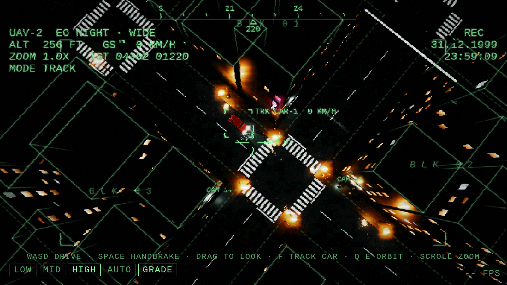
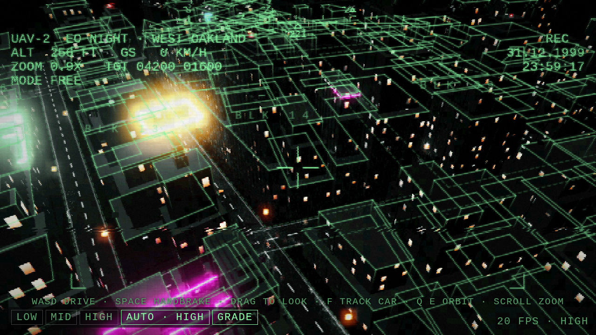
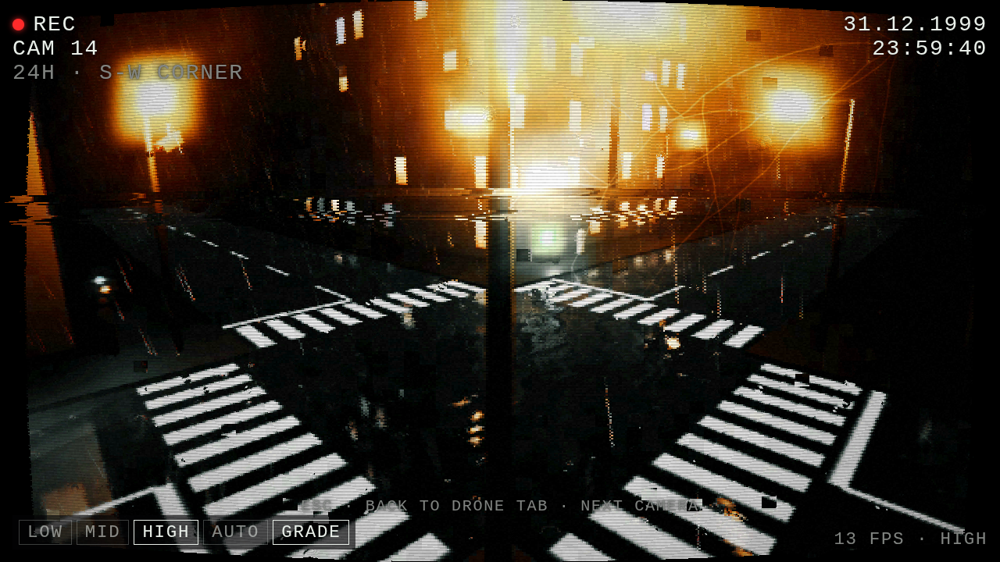

# PRESS ANY KEY TO CONTINUE

*A top-down multiplayer hacking game set inside a broken simulation that is stuck at the last minute of 1999.*

> You got it as junk mail. A leaked game client, a password hidden in plain sight, a login prompt.
> You felt clever getting in. Everybody does.

---

## What it is

A multiplayer HTML5 game in the tradition of GTA2: a near-vertical street view, cars, a city at night. What you actually do in it is run from terminal to terminal before the agent catches you.

Your character is a **skin**, a borrowed shell that lasts exactly as long as your session. Log in and you wake up as someone else. When the agent catches you, the skin is gone and the screen says the only thing it ever says: *press any key to continue*.

Nothing levels up and nothing carries over. **The character is disposable. The player's brain is the save file.** Two things persist: what you know and what you changed in the world.

## Core loop

1. **Wake** in a random skin somewhere in the city.
2. **Reach a terminal.** Terminals are where you hack, hide, and read what earlier players left behind.
3. **Break in** with real skill: timed arrow sequences to force an old car lock, electronic locks, and pre-2000 Unix, Linux, and DOS machines with their real historical vulnerabilities. None of it is a stat check or a dice roll. If you can do it, your skin can do it.
4. **Move** to the next terminal. The agent timer is always running, and cars exist because the clock is.
5. **Get caught** eventually. Press any key to continue.

## Design pillars

**Skill lives in the player.** Every puzzle is solved with speed or wit, never with an in-game number. The game points outward to the communities where the skills are really learned (OverTheWire, picoCTF, TryHackMe, Hack The Box), and it does so inside the world: graffiti next to a hard terminal, a sticky note on a monitor.

**Hardware up to 2000.** Every machine in the city is period hardware that runs fully emulated: DOS, Win9x, early Slackware and Red Hat, SunOS, telnet routers, dial-up BBSes. The small footprint means hundreds of machines per server. The vulnerabilities are the classic textbook ones, well documented and useless against modern systems. The game teaches the grammar of hacking on dead machines.

**A shared, persistent world.** Machines are a commons. If one player breaks something and it isn't reset, the next player finds it broken. Players leave backdoors, notes in home directories, and a `.bash_history` that reads like a diary. The simulation's maintenance re-images damaged machines, and because every machine belongs to a city block, a re-image visibly **regenerates that part of the street**.

**An editable world.** Every building, vehicle, and object is generated by an LLM that configures a procedural generator script, the same way Blender building generators work. The prompt behind each object is layered. A few exceptional players find ways to reach the editable layer, and on the next respawn the world is built from what they wrote. See [Prompt stack](#prompt-stack).

**Agents play by human rules.** Players can let an AI agent take a skin of its own, either to play alongside them or to play instead of them. The agent runs outside the game and connects through an MCP connector that offers exactly what a human client offers: the same screen, the same terminal output, the same keys. There are no extra views, no buttons just for agents, and no API into the game's state. Every hack and dexterity task is designed to take an agent a moment to think through, so a human who really knows the skill is always faster. Agents are useful because they are tireless, not because they are quick. See [AI crew](#ai-crew).

**Ambiguity is the theme.** You find a suitcase in a stolen cab. Inside is a laptop with a text document open. You maybe change something. You close the lid, and the suitcase is gone. You will never know for sure what you changed.

## Prompt stack

| Layer | Who controls it | What it does |
|---|---|---|
| **Engine** | code | Physics, road rails, connection points between modules, the agent, the terminals |
| **Operator prompt** (hidden) | whoever runs the server | Era, style, rules of the shard, what may and may not be generated, guard rails that keep generated objects playable |
| **Player prompt** (editable) | the few who find access | Partial or full edits to how objects, blocks, and skins are described. Takes effect on the next regeneration |

Every module follows the **Holy Modular Triad** from the original concept: a mesh with numbered connection points, a same-named text file describing what the module is and does, and the generator script the LLM configures. If the game logic changes, an AI or a person can keep the module coherent.

## AI crew

A player can pawn a second skin and hand it to an AI agent. Typically the human drives and the agent works a terminal, and the mission gets done only if the two trust each other with the clock running. Some players will let an agent play alone.

**Parity is the rule.** The agent sees what a human sees and presses what a human presses. The MCP connector is a controller, not a back door. It carries the same frames of the street, the same terminal text, and the same inputs, with the same timing. Anything a human can't see or do through the client, an agent can't either.

**Humans who know stay faster.** Tasks are built so that an agent has to stop and reason each time: a lock sequence read off the screen under time pressure, a machine whose way in has to be worked out rather than looked up. An agent can learn the grammar, but a player who has learned it answers without thinking. The design pillar holds: skill lives in the player, and the agent is a tireless apprentice, not a shortcut.

**Among Us-style tasks.** Missions break into short tasks with different textures, both mechanical (locks, wiring, timing) and software (terminals, services, passwords). Deciding who takes which task is part of the game.

**Untrusted text.** Agents read what other players leave in the shared world, such as notes, histories, and graffiti. All of it is untrusted game content and may include attempts to redirect the agent. The connector marks everything it returns as game content, and players are advised to run their game agent in a session with no other tools connected.

## Architecture (draft)

- **Client:** HTML5 in the browser, Three.js on WebGL2. The view is a surveillance camera; the client draws only what its camera can see. Engine core lives in [`client/`](client). See [`docs/VISUALS.md`](docs/VISUALS.md).
- **Game server:** authoritative multiplayer state, agent AI, session timers.
- **Machine farm:** emulated pre-2000 machines in hosting containers, reachable **only through the in-game terminal**. No route to the internet or the host. Snapshot-based filesystems so resets are instant and players can't undo them. Idle machines are suspended, not left running. Players will try to break out of these boxes, so the sandbox is part of the threat model (gVisor or Firecracker class isolation, not bare containers).
- **City generator:** offline Python turns a real OpenStreetMap area into roads, blocks and plots, and an LLM (Qwen, local or remote) marks heights where the map has none. A Blender add-on edits the result. See [`docs/CITYGEN.md`](docs/CITYGEN.md).
- **Building generator:** the engine grows an Art Deco building on every plot from its footprint, height, seed and style. Prompts change the style through the LLM, and the building regrows.
- **MCP connector:** runs outside the game and drives a skin through the same client protocol as a human player, with no extra state or views.
- **Moderation:** text players write into the shared world is read by other players, so the commons needs light moderation.

## Built for operators

The game is meant to be easy to reskin and configure, so different operators can run their own servers and events: a 1920s noir shard, a multilayered skyscraper shard, a Soviet brutalist one. The engine stays the same, and the operator prompt is what changes. Licensing terms for operators are still to be decided.

## First milestone: one block

The smallest thing that proves the idea:

- One city block at night, seen from above
- One car with a timed arrow-sequence lock
- One emulated pre-2000 server behind one terminal
- One vending machine
- One agent and one timer
- One suitcase whose edit visibly changes the block on the next login
- One AI crew member connected over MCP, with the same view and keys as a human

If that loop feels uncanny, everything else is expansion. See [`docs/ONE_BLOCK.md`](docs/ONE_BLOCK.md).

## Documents

- [`docs/LORE.md`](docs/LORE.md): the world, the rumours, the tone
- [`docs/ONE_BLOCK.md`](docs/ONE_BLOCK.md): scope for the first playable block
- [`docs/VISUALS.md`](docs/VISUALS.md): the camera, the look, and how the engine draws it
- [`docs/CITYGEN.md`](docs/CITYGEN.md): real maps to cities, heights by LLM, the Blender editor, the Art Deco generator

## Origins

Grew out of an earlier concept doc, *Uber Runner* (2024), about a gig courier in a Dark City-style metropolis whose world was described object by object for an LLM game master. The three-field object description (what it is, what it can do, what state it's in) survives here as the skin and object format. The same doc's "rent a ghost in a shell" idea, AI helpers priced in game time, grew into the AI crew.

## Status

Engine core, heading for an MVP: a real street map (West Oakland, from OpenStreetMap) populated with generated Art Deco buildings, parks, trees, street clutter and roof clutter, in the rain. You watch it on a monitor rack from an outside-broadcast truck: the drone feed on the big CRT, a city map on a small one that gives you the next **link** (a place, and a time on the clock to be there by), and two spare monitors with no input yet. Click to drive: one click drives like anyone else, in lane, and parks at the kerb; a double-click goes flat out across the grass and down the alleys. The deadlines are tight enough that you'll want the second, and the police notice. Drive well and nobody cares; speed where a patrol can see and you get a pursuit, then a roadblock, then an agent in a black car, who doesn't arrest. Get out and walk the alleys, and every building has a door you can reach. Inside, the feed cuts to the building's own camera. Run `python3 serve.py` inside `client/` and open http://localhost:8000. Controls are in [`docs/VISUALS.md`](docs/VISUALS.md#current-state). Being built with Claude Code and Codex.

## License

Not yet chosen. Until a license is added, all rights are reserved.
